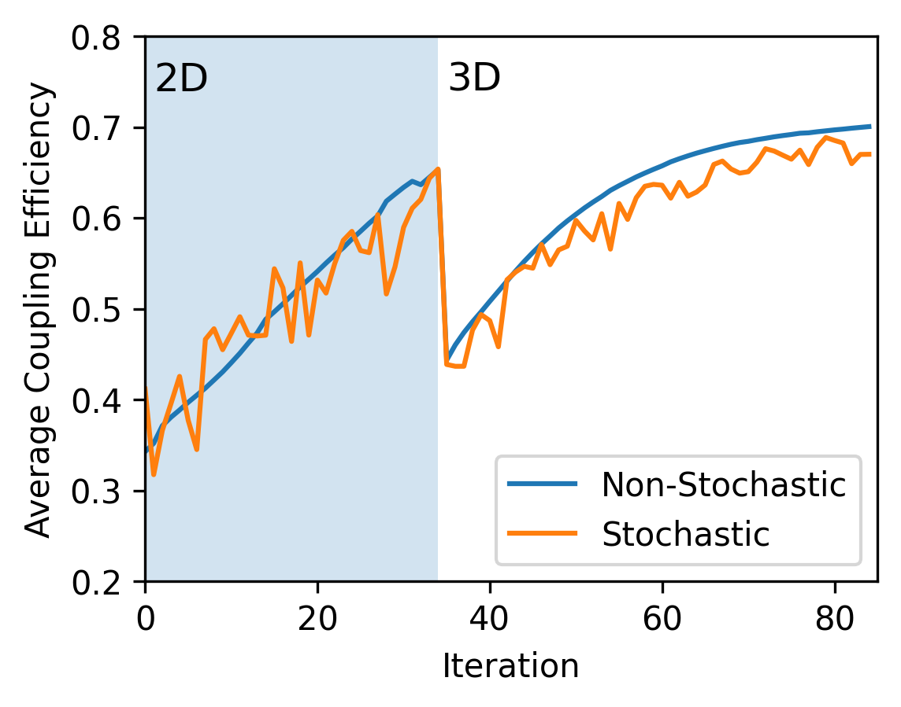
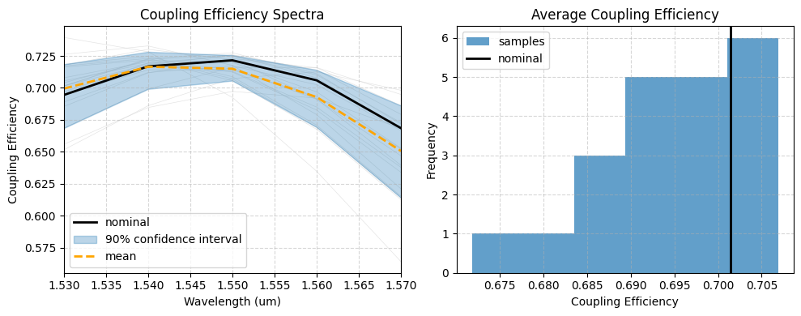
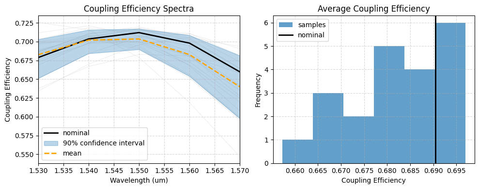

# GratingCouplerOpt

Inverse design of integrated grating couplers, plus a statistical
(yield) analysis of how the optimized designs hold up under fabrication variation. 
Both non-stochastic and stochastic gradient descent are studied.

Simulations are run with [Tidy3D](https://www.flexcompute.com/tidy3d/) FDTD and
optimized with adjoint gradients using `autograd` + `optax`/Adam. 

Optimize an InP grating coupler for average coupling across 1530–1570 nm and a spot size of 4 $\mu\text{m}$. 
Initial optimization is performed on a 2D device before further optimization on the full 3D device. 

## Main Results

We achieve 70% (1.6 dB) coupling efficiency from the input fiber to the waveguide. The yield analysis 
shows a standard deviation of 1% in average coupling. This is an incredibly efficient design, especially for the small 
device footprint of roughly 40 $\mu\text{m}^2$. 

The initial device has the layout shown below:


The green field is the input beam and the orange areas are the monitors. 

We allow the size of the teeth and gaps, the etch depth, the length of the taper, and the distance to the substrate to change, within 
set bounds, during the inverse design process. 

We use non-stochastic and stochastic inverse design to account for fabrication variations. 
The device is assumed to have two parameters that change with fabrication: the etch depth and the size of the grating teeth. 
Both follow a normal distribution with mean zero and standard deviation of 5 nm.

Below we show the optimization curves of both optimization types through the 2D and 3D stages:



The final device is studied with Monte Carlo analysis of the previously stated fabrication variations. The final results are shown below for the non-stochastic design:



and for the stochastic optimization:



The key results are summarized in the table below:

|                        | Average Coupling Efficiency | Standard Deviation |
|------------------------|----------------------------|-------------------|
| Non-stochastic         | 69%                        | 0.9%                |
| Stochastic             | 68%                        | 1.1%                |

Both inverse design methods give good coupling and a low impact from fabrication variation.

## Main files

### `GC_4um_2D/` — 2D InP grating coupler
| File | Purpose |
| --- | --- |
| `main.py` | Core library. Builds the parametrized grating geometry (`make_grating_structure`), assembles the Tidy3D simulation (`make_sim`), apodization helpers (`apodized_to_widths`, `get_centers`), the tanh parameter projection/bounds (`projection_builder`), the Adam optimization loop (`run_adam`), and the coupling-efficiency figure of merit (`get_coupling_efficiency`). |
| `testing.ipynb` | Initial apodized design, simulation setup, and adjoint-gradient checks before optimization. |
| `initial_opt.ipynb` | Adjoint/Adam gradient optimization starting from the initial apodized parameters. |
| `stochastic_opt.ipynb` | Stochastic gradient descent that samples fabrication errors (etch depth and over/under-etch ~ N(0, 5 nm)) each step for a fabrication-robust design. |
| `sensitivity.ipynb` | Monte Carlo yield analysis of the optimized designs under the same fabrication perturbations. |
| `data/opt/*.pkl` | Saved optimization histories (`history.pkl`, `history_stochastic.pkl`). |
| `data/tidy3d_output/*.hdf5` | Cached Tidy3D simulation results. |

### `GC_4um_3D/` — 3D InP grating coupler
| File | Purpose |
| --- | --- |
| `main.py` | 3D counterpart of the 2D core library: tapered 3D geometry (`get_tooth_arc`, `make_grating_structure`), simulation setup (`make_sim`), optimization (`run_adam`), checkpoint helpers (`save_checkpoint`, `load_checkpoint`), and the coupling-efficiency FOM. |
| `testing.ipynb` | Initial 3D design built from the 2D optimized parameters; verifies the simulation and adjoint gradients before 3D optimization. |
| `initial_opt.ipynb` | Non-stochastic adjoint/Adam optimization in 3D, seeded from the 2D result. |
| `stochastic_opt.ipynb` | Stochastic gradient descent in 3D with the same fabrication-error model as the 2D case. |
| `sensitivity.ipynb` | Monte Carlo comparison of the standard and stochastic 3D optimized designs. |
| `data/3d_opt/*.pkl` | Saved 3D optimization histories and logs (`history.pkl`, `history_stochastic.pkl`, `opt_log_*.pkl`). |
| `data/tidy3d_output/*.hdf5` | Cached Tidy3D simulation results. |

### `media/`
| File | Purpose |
| --- | --- |
| `plotGenerator.ipynb` | Loads saved optimization histories and generates the README figures (`opt_curve.png`, sensitivity plots, etc.). |
| `*.png` | Result figures referenced in this README. |

## Setup

```bash
python3 -m venv venv
source venv/bin/activate
pip install -r requirements.txt
```

Running Tidy3D simulations requires a FlexCompute account and an API key
configured via `tidy3d configure`.