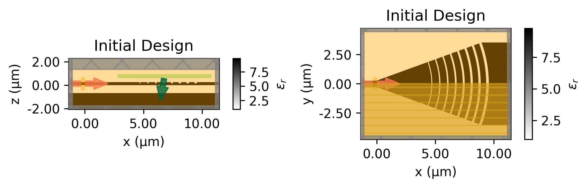

# GratingCouplerOpt

Inverse design of integrated grating couplers, plus statistical
(yield) analysis of how the optimized designs hold up under fabrication variation. 
Both non-stochastic and stochastic gradient descent are studied.

Simulations are run with [Tidy3D](https://www.flexcompute.com/tidy3d/) FDTD and
optimized with adjoint gradients, optimization preformed with `autograd` + `optax`/Adam. 

Optimize a InP grating coupler for average coupling across 1530-1570nm and a spot size of 4$\mu$m. 
Initial optimization preformed on a 2D device before further optimization on full 3D device. 

## Main Results

We achive a 70%, 1.6 dB, coupling efficency from the input fiber to the waveguide. The yeild analysis 
shows a standard deviation of 1% average coupling. This is an increibly efficent design, especially for the small 
device footprint of roughly 40$\mu m^2$. 

The initial device has the layout shown below:



The green field is the input beam and the orange areas are the monitors. 

We allow the size of the teeth and gaps, the etch depth, the length of the taper, and the distance to the substrait to change, within 
set bounds, during the inverse design proccess. 

We use non-stochastic and stochastic inverse design to account for fabrication variations. 
The device is assumed to have two parameters that change with the fabrication: the etch depth and the size of the grating teeth. 
Both follow a normal distributation with mean zero and standard deviation 5.

Below we show the optimziation curves of both optimization types through the 2D and 3D stages:


## Main files

### `GC_4um_2D/` — 2D InP grating coupler
| File | Purpose |
| --- | --- |
| `main.py` | Core library. Builds the parametrized grating geometry (`make_grating_structure`), assembles the Tidy3D simulation (`make_sim`), apodization helpers (`apodized_to_widths`, `get_centers`), the tanh parameter projection/bounds (`projection_builder`), the Adam optimization loop (`run_adam`), and the coupling-efficiency figure of merit (`get_coupling_efficiency`). |
| `playground.ipynb` | Scratch notebook for setting up and visually checking the simulation. |
| `bayesianOpt.ipynb` | Bayesian optimization to find good initial design parameters (apodization rate `R`, `r0`, fill factor, etch depth). |
| `initial_opt.ipynb` | Adjoint/Adam gradient optimization starting from the found initial parameters. |
| `stochastic_opt.ipynb` | Stochastic gradient descent that samples fabrication errors (etch depth, alignment, over/under-etch ~ N(0, 5 nm)) each step for a fabrication-robust design. |
| `adjoint_sensitivity.ipynb` | Adjoint-based sensitivity analysis of the final design to the same fabrication perturbations. |
| `random.ipynb` | Quick scratch notebook for plotting/comparing saved optimization runs. |
| `data/*.json` | Saved optimization histories (initial vs. stochastic, 50 nm / 100 nm grids, 6-tooth variant). |

### `GC_3D_4um_Si/` — 3D Si grating coupler
| File | Purpose |
| --- | --- |
| `main.py` | 3D counterpart of the 2D core library: geometry, simulation setup, optimization, and FOM for the silicon device. |
| `device.ipynb` | Description and visualization of the 4 µm 3D grating coupler device. |
| `opt.ipynb` | 3D gradient-based optimization of the grating coupler (seeded from the 2D result). |
| `playground.ipynb` | Scratch notebook for building/checking the 3D simulation. |
| `analysis.ipynb` | Performance analysis of the optimized device (incident angle, misalignment sweeps). |
| `data/*.pkl` | Saved optimization states (2D-seed and 3D runs). |

## Setup

```bash
python3 -m venv venv
source venv/bin/activate
pip install -r requirements.txt
```

Running Tidy3D simulations requires a Flexcompute account and an API key
configured via `tidy3d configure`.